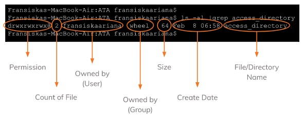

# (10)_Linux_Basic_Command

## A. Linux Commands
 Linux merupakan jenis operating system (OS) yang bersifat open source sekaligus gratis dan dapat digunakan dan dikembangkan dengan bebas.
 Command line adalah perintah yang berisikan *text-base* dan sangat berguna karena ini lebih cepat daripada menggunakan GUI.
 Command line digunakan karena beberapa sebab, yaitu membutuhkan sumberdaya yang sedikit, *repetitive task friendly* , dan powerful dalam penggunaannya.

## B. Bentuk dan macam dari commands Linux
 1. **Linux Commands Structure** => penulisannya yaitu **command [options] [parameters]** . Contoh: (ls -a /usr) , (ls -a -l) , ( ls -al)
 2. **Basic Commands** => cal, date, etc
 3. **File System Commands** => touch, cat, cp, mv, rm, mkdir, rmdir, cd, pwd
 4. **Processes Control Commands** => top, clear, history, etc
 5. **Utilities Programs Commands** => ls, which, sudo, find, etc
 6. **File Access Permissions** => chmod, chown, etc
 
 
 d|rwx|rwx|rwx => cara bacanya yaitu, 
 1. File type => - (terindikasi reguler file) dan d (terindikasi *directory*)
 2. *Read, write, execute* izin ke **file owner**
 3. *Read, write, execute* izin ke **grup owner**
 4. *Read, write, execute* izin ke **other user**
 (Kode binary rwx : 111,111,111 => 7,7,7)

## C. Shell Script
 Shell adalah sebuah program yang berfungsi sebagai jembatan antara user dan kernel
 Shell Script adalah kompilasi bahasa pemrograman yang berdasar pada *shell commands* 
