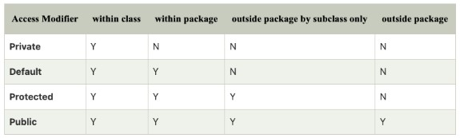
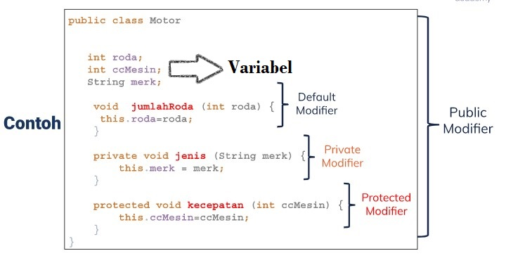
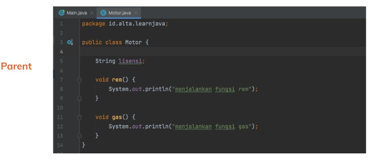
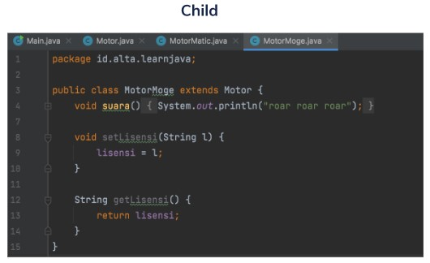

# (12)_Introduction_Basic_Programming

## *Object Oriented Programming* (OOP)
 OOP terdiri dari beberapa hal dan yang akan dibahas (main), yaitu:
	1. Objek (main)
	2. Class (main)
	3. Method (main)
	4. Attribute (main)
	5. Polymorphism
	6. Abstraction
	7. Encapsulation
	8. Inheritance (main)

### Class
 Jika diibaratkan sebuah motor, maka kelas motor tersebut memiliki beberapa pembeda, seperti jenis mesin, jenis motor, dll. Pembeda tersebutlah yang nantinya disebut sebagai object.
 Penulisan coding dari class ini tergolong sederhana, yaitu:
	Public class <namaclass> {
		// Body class
	}

### Object
 Dalam sebuah objek dapat ditemukan menjadi 3 jenis yang menyusunnya, yaitu deklarasi, instantiasi, dan initialisasi. Contoh:
 	Motor			        objectmotor 		    = new Motor();
 (Inisialisasi Nama Objek) (Deklarasi Nama Objek)	(Instantiasi Objek)
 Dalam penulisan nama inisialisasi dan instantiasi harus sama dengan nama Class.

### Method
 Dalam sebuah method ada dua jenis penyusunnya yaitu:
  1. Access Modifier (Modifikasi akses)
	a. Public	b. Default	c. Private	d. Protect
	Peruntukan/penjelasan siapa yang bisa akses dapat dilihat pada gambar di lampiran.
	Penjelasan penggunaan dari keempat jenis diatas dapat dilihat pada gambar di lampiran.

  2. Variabel

### Inheritance
 Prinsip penggunaannya yaitu seperti pendetailan dari bagian yang lain. Contoh penggunaannya terlampir pada gambar dibawah.

#### Lampiran
1. Access Modifier
 
2. Contoh penggunaan Access Modifier
 
3. Penggunaan Inheritance
 Parent:
  
 Child:
  