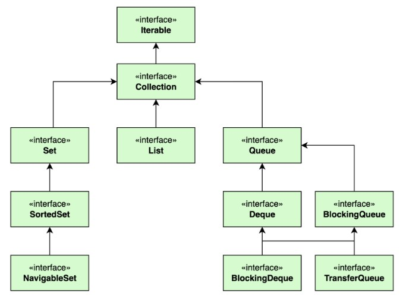
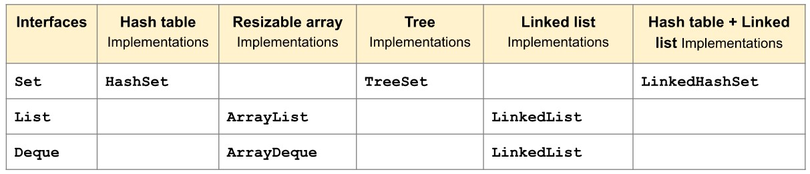
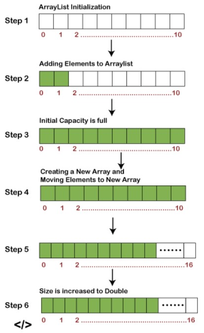
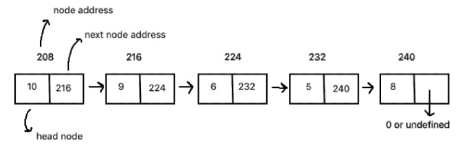
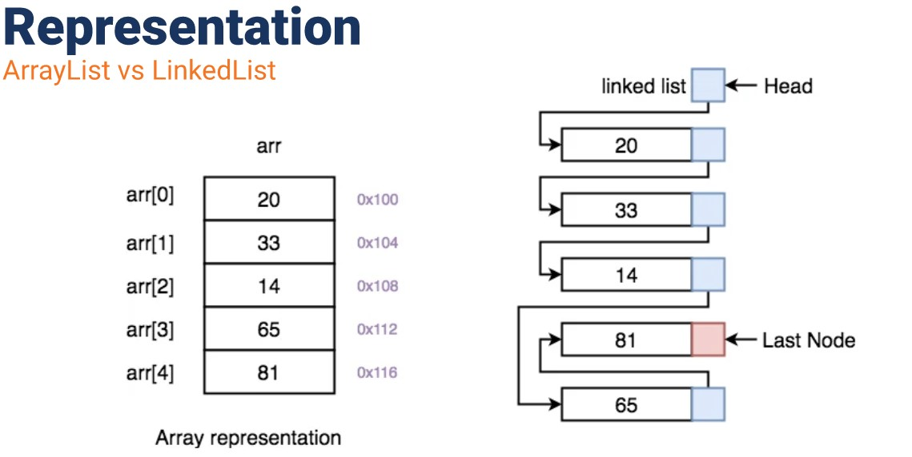
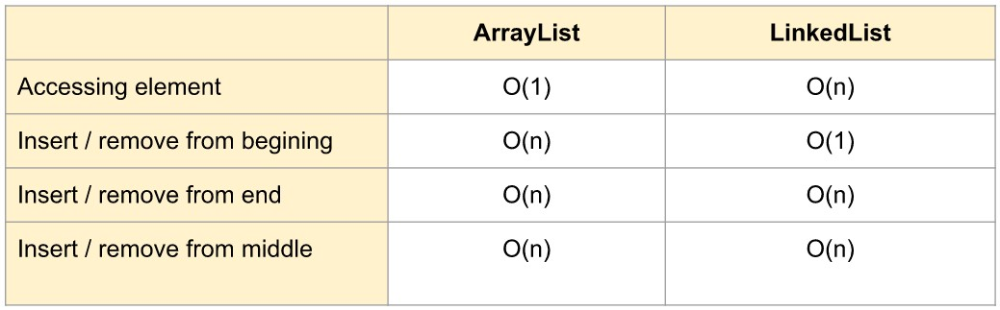
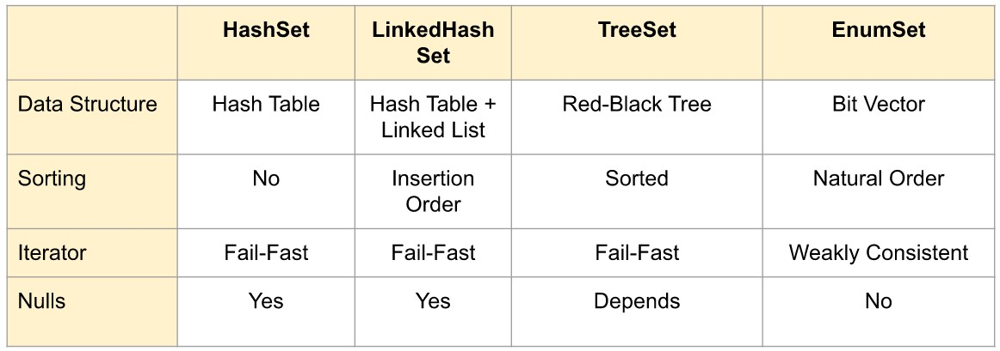

# (14)_Iterable_Data_Structure

## Iterable
 Merupakan sekumpulan data atau struktur data yang dapat dilakukan iterasi/perulangan kepadanya.
 A. Hirarki Interface pada Java Iterable
  Seluruh interface ini merupakan struktur/kumpulan data yang dapat dilakukan perulangan terhadap masing-masing data yang disimpan.
  
  ket :
  	1. Interface Iterable (paling tertinggi)
  	2. Interface Collection (dibawah Iterable)
  	3. Interface Set, SortedSet, NavigableSet
  	4. Interface List
  	5. Interface Queue, Deque, BlockingDeque, TransferQueue, BlockingQueue

 B.Implementasi dari Interface sebelumnya
 
  Artinya : jika kita ingin menggunakan struktur data dari masing-masing implementation ini, kita bisa juga menggunakan interface Set, List, Deque sebagai TIPE DATA dari VARIABEL tempat kita menyimpan kumpulan data tersebut.

 C. Methode yang dapat digunakan pada Interface Iterable:
 	1. ForEach(Consumer<? super T>):void
  	Contoh:
		Publid static void main(String[] args) {
		Iterable<String> names = list.of("alterra, "academy");
	 	for (var name; names){
			sout(name);
	 	 }
		}
  	keterangan:
		- Iterable = tipe data
		- names = nama variabel
		- alterra, academy = data dari variabel yang dibuat melalui list
		- karena variabel names ini adalah iterable maka dapat digunakan dalam sebuah for each

 	2. Iterator():Iterator<T> 
  	Iterator merupakan class yang memanage iterasi dari sebuah iterable. Interator ini mengelola pada bagian mana kita sudah melakukan iterasi pada data iterable. Dan mengetahui data apa yang berikutnya dapat diambil dan bagaimana cara mengambilnya.
  	contoh : 
 		import java.util.Iterator;
 		import java.util.list;

 		Public class Main{
	 	 Publid static void main(String[] args) {
	 	 Iterable<String> names = list.of("alterra, "academy");
	 	 Iterable<String> it = names.iterator();	// ket 2
	 		while(it.hasNext()) {				// ket 3
			String i = it.next();
			sout(i);
	  	  }
	 	 }
 		}
  	keterangan :
		- Jadi ini kodingan dari bahasan for each
		- Dibuat variabel baru bernama "it" yang berisi names.iterator(); (atau iterator dari iterable yaitu names)
		- Dibuat looping jika iterator memiliki data berikutnya
		- Maka akan muncul looping dengan nama alterra, academy

## Collections
 Merupakan kumpulan objek atau data yang diletakkan dalam satu tempat yang sama dan ini dikenal sebagai *collection of objects*. Pada hirarki diawal, collections merupakan turunan dari interface Iterable, lalu ada banyak lagi interface yang menjadi turunan dari interface collection ini.
 Method yang ada pada Collections sekilas berisi proses:
	- Penambahan
	- Penghapusan data
	- Memeriksa isi dari data yang tersedia
	- lalu methode dari Iterable seperti iterator dan juga spliterator lalu ada juga method untuk melihat ukuran dari collection.
 	contoh :
	 Publid static void main(String[] args) {
	  Collection<String> names = new ArrayList<>();
	  names.add("alterra");
	  names.add("academy");
	  names.add("coba");
	  names.remove("coba")
	  sout(names.contains("alterra"));
	 }
 	keterangan:
		- Collection = tipe data
		- names = nama variabel
		- new ArrayList = nilai/data yang digunakan pada variabel names
		- names.add = untuk menambahkan data
		- names.remove = untuk hapus data
		- names.contains = untuk memeriksa isi data
		- kalau di run hasilnya true karena ada nama alterra di dalam kodingan tsb.

## List
 A. Merupakan :
  - sebuah interface yang menyediakan cara untuk menyimpan data secara linear.
  - Turunan dari interface Collection.
  - **Dapat menerima nilai yang sama**, jadi ketika kita menginputkan dua kali data yang bernilai sama, pada list itu dapat dilakukan.
  - **Urutan data** pada list **bergantung pada kapan data itu dimasukkan** kedalam list, jadi data yang pertama kali dimasukkan akan ada di urutan pertama, lalu pada data berikutnya akan menyusul di urutan" selanjutnya.
 B. Method yang ada pada list pada dasarnya digunakan untuk memanajemen data yang terdapat pada list, seperti: 
  - Menambah
  - Menghapus
  - Mengecek apakah data tersedia dalam list
  - **Mencocokan** apakah **list sama dengan list yang lainnya**, kemudian methode lain yang terdapat pada collection.
 C. Pada hirarki implementasi List dapat di kelompokan menjadi beberapa:
	1. ArrayList
	2. LinkedList
	3. ImmutableList
	4. Stack

  1. ArrayList
	Menyediakan penyimpanan data yang dinamis (tidak terikat dengan kapasitas data yang dapat disimpan oleh ArrayList tersebut)
	Jadi data yang disimpan pada ArrayList itu bisa sebanyak apapun selama memori dari komputer masih sanggup untuk menyimpan data tersebut. Cara kerja ArrayList pada dasarnya memiliki panjang yang terbatas, namun karena kemampuan menyesuaikan dengan data yang ada (membuat panjang yang baru sesuai data) maka seolah olah ArrayList ini memiliki panjang yang tidak berbatas.
	
	contoh :
	 Publid static void main(String[] args) {
	  List<Integer> umur = new **ArrayList**<>();
	  names.add(17);
	  names.add(60);
	  names.add(30);
	  sout(names.get(2));
	 }

  2. LinkedList
	Merupakan struktur data yang **menyimpan setiap elemennya saling terhubung satu sama lain**. **Cara LinkedList menghubungkan satu elemen dengan elemen yang lainnya** adalah dengan **menyimpan alamat memory dari masing-masing elemen**, baik elemen setelah atau sebelumnya. Jadi jika ada elemen pada LinkedList maka elemen tersebut akan menyimpan alamat memory dari elemen sebelumnya, dan seterusnya.
	
	Perbedaan ArrayList dengan LinkedList
	
	Time Complexity
	
	contoh :
	 Publid static void main(String[] args) {
	  List<Integer> umur = new **LinkedList**<>();
	  names.add(17);
	  names.add(60);
	  names.add(30);
	  sout(names.get(2));
	 }

  3. Immutable List
	Merupakan bagian dari List tetapi Immutable List **tidak dapat diubah datanya**, sehingga ketika kita memiliki sebuah Immutable list (dalam hal ini namanya "umurImmutable") maka untuk proses "umurImmutable.add(2);" ini tidak diizinkan karena umurImmutable tidak dapat diubah data didalamnya.
	contoh : (error program Immutable)
	 Publid static void main(String[] args) {
	  List<Integer> umur = new LinkedList<>();
	  **var umurImmutable = Collections.unmodifiableList(umur);**
	  umurImmutable.add(2);
	  names.add(17);
	  names.add(60);
	  names.add(30);
	  sout(names.get(2));
	 }

  4. Stack
	Menyimpan data secara linear tetapi dalam proses penambahan dan pengambilan datanya itu menggunakan LIFO (last-in-first-out) -> (data yang terakhir dimasukkan akan dikeluarkan terlebih dahulu). Method pada Stack yaitu :
		- pop(mengambil/menampilkan data), 
		- push(menambah data), 
		- pick(mengintip)
	contoh :
	 Publid static void main(String[] args) {
	  Stack<Integer> umur = new **Stack**<>();
	  umur.push(7);
	  umur.push(10);
	  umur.push(5);
	  sout(umur.pop());
	 }

## Set
 A. Merupakan sebuah struktur data yang dapat **menyimpan sekumpulan data secara linear (sama seperti list)** tetapi set **tidak dapat menerima data yang duplikat**. Jadi kalau ada data kembar maka set akan menganggap bahwa data tersebut hanya satu saja.
 B. Pada hirarki implementasi Set dapat di kelompokan menjadi beberapa:
	1. HashSet
	2. LinkedHashSet
	3. EnumSet
	4. TreeSet
	5. Dibawah Set ada SortedSet dan NavigableSet
  Jika dibandingkan antara hirarki tersebut, dapat dilihat seperti gambar dibawah 
  
  Fail-Fast = menerima error dengan cepat

   1. HashSet
	Secara garis besar method" tersebut dapat digunakan untuk mengelola seluruh data atau elemen yang terdapat dalam HashSet.Bagian yang menarik dari HashSet adalah **HashSet dikatakan sebagai struktur data yang menyediakan cara tercepat untuk proses pencarian data**.
	contoh : 
  	 public static void main(String[]args){
  	 Set<Integer> umur = **new HashSet**<>();
   	  umur.add(3);
   	  umur.add(3);
   	  umur.add(4);
	  umur.add(2);
   	  sout(umur);
  	 } 
	keterangan:
		- Set = tipe data
		- umur = nama variabel
		- new HashSet = nilai/data yang digunakan pada variabel umur
		- umur.add = untuk menambahkan data
		- kalau di run hasilnya 2,3,4. yang 3-nya hanya muncul sekali karena set tidak menerima data duplikat.

   2. LinkedHashSet
	Menyimpan secara insertion order (data yang diinput terlebih dahulu maka akan terdapat pada urutan yang paling depan).
	contoh : 
  	 public static void main(String[]args){
  	 Set<Integer> umur = **new LinkedHashSet**<>();
   	  umur.add(3);
   	  umur.add(3);
   	  umur.add(4);
	  umur.add(2);
   	  sout(umur);
  	 } 
	keterangan:
		- Set = tipe data
		- umur = nama variabel
		- new LinkedHashSet = nilai/data yang digunakan pada variabel umur
		- umur.add = untuk menambahkan data
		- kalau di run hasilnya 3,4,2. sesuai urutan data saat diinputkan.

   3. EnumSet
	Set jenis ini digunakan untuk menyimpan nilai Enum dan untuk urutannya mengikuti urutan penulisan Enum tersebut.
	contoh : 
	 Public class Main {
	  enum months {
		Jan, Feb, Mar, Apr, Mei, Jun, Jul, Ags, Sept, Okt, Nov, Des}
	  public static void main(String[]args){
		Set<months> set = EnumSet.allOf(months.class);
		Iterator<months> iter = set.iterator();
		while (iter.hasNext())
		 sout(iter.next());
	  }
	 }
	keterangan:
		- Set = tipe data 1
		- set = nama variabel 1
		- EnumSet.allOf() = nilai/data yang digunakan pada variabel set
		- months = Enum
		- Iterator = tipe data dalam iterator
		- iter = nama variabel dari tipe data iterator
		- set.iterator = data (nama variabel 1.tipe data dalam iterator)
		- while = untuk method perulangan 
		- iter.hasNext = data selanjutnya dari variabel iter
		- kalau di run hasilnya data dari enum = Jan, Feb, Mar, Apr, Mei, Jun, Jul, Ags, Sept, Okt, Nov, Des.

## SortedSet (Mengelola urutan dari data)
 A. Method uniq yaitu 
	- headSet (untuk melihat bagian kepala dari elemen yang terdapat pada set tersebut)
	- tailSet (untuk melihat bagian ekor dari elemen yang terdapat pada set tersebut)
 B. Ada implementasi Sorted Set, yaitu terdapat:
	1. Navigable Set
	2. Tree Set
	Tetapi Navigable Set ini berupa interface sehingga implementasi yang dapat digunakan yaitu Tree Set.
 
   1. TreeSet
	contoh : 
  	 public static void main(String[]args){
  	 SortedSet<Integer> umur = **new TreeSet**<>();
   	  umur.add(3);
   	  umur.add(3);
   	  umur.add(4);
	  umur.add(2);
   	  sout(umur);
  	 } 
	keterangan:
		- SortedSet = tipe data
		- umur = nama variabel
		- new TreeSet = nilai/data yang digunakan pada variabel umur
		- umur.add = untuk menambahkan data
		- kalau di run hasilnya 2,3,4. Karena sorted Set ini telah mengurutkannya sendiri.

   2. NavigableSet
	contoh : 
  	 public static void main(String[]args){
  	 NavigableSet<Integer> umur = **new TreeSet**<>();
	 NavigableSet<Integer> umurDesc = umur.descendingSet();
   	  umur.add(3);
   	  umur.add(3);
   	  umur.add(4);
	  umur.add(2);
   	  sout(umurDesc);
  	 } 
	keterangan:
		- NavigableSet = tipe data
		- umur = nama variabel 1
		- new TreeSet = nilai/data yang digunakan pada variabel umur
		- umurDesc = nama variabel 2
		- umur.descendingSet = nilai/data dari variabel 2
		- Descending = urutan data dari yang terbesar ke terkecil
		- Ascending = urutan data dari yang terkecil ke terbesar
		- umur.add = untuk menambahkan data
		- kalau di run hasilnya 4,3,2. Karena sesuai perintah diurutkan dari terbesar ke terkecil.

## Queue
 Queue disini mengimplementasi mekanisme first in first out (data yang lebih dulu masuk akan keluar lebih dulu, ibarat antrean). Untuk mengambil data dalam Queue dapat digunakan Dequeue (akan mengambil data yang paling depan dari sebuah queue). Untuk menambahkan data dalam Queue dapat digunakan Enqueue (akan menambahkan data pada bagian belakang) sesuai konsep antrean (gaboleh nyelak)
 A. Implementasi dari Queue:
	1. PriorityQueue
	2. ArrayDequeue
	3. LinkList

   1. contoh Queue: 
  	 public static void main(String[]args){
  	 Queue<Integer> umur = **new PriorityQueue**<>();
   	  umur.add(7);
   	  umur.add(10);
   	  umur.add(5);
   	  sout(umur.poll());
  	 } 
	keterangan:
		- Queue = tipe data
		- umur = nama variabel
		- new PriorityQueue = nilai/data yang digunakan pada variabel umur
		- umur.add = untuk menambahkan data
		- poll = method yang akan mengambil data berdasarkan urutan prioritasnya, 
		- kalau di run hasilnya 5. Karena proses urutan prioritasnya akan diatur oleh PriorityQueue itu sendiri dalam hal ini prioritas utamanya adalah 5.

   2. Deque (double ended queue)
	Merupakan sebuah queue tetapi memiliki dua ujung.
	Method pada Deque:
		- Bisa menambah data dengan addFirst dan addLast (artinya kita bisa menambah pada bagian depan ataupun belakang)
		- Bisa mengambil data dengan getFirst dan getLast (artinya kita bisa mengambil pada bagian depan ataupun belakang)
	Kita bisa mengoperasikan data yang depan dan juga yang belakang dari queue. Oleh karena itulah queue jenis ini dipanggil double ended queue, karena dapat dikelola pada bagian depan ataupun belakang.
	contoh Deque: 
  	 public static void main(String[]args){
  	 Deque<String> bulan = **new LinkList**<>();
   	  bulan.offerLast("1");
   	  bulan.offerLast("2");
   	  bulan.offerLast("3");
   	  sout(bulan.pollLast());
  	 } 
	keterangan:
		- Deque = tipe data
		- bulan = nama variabel
		- new LinkList/ArrayDeque = nilai/data yang digunakan pada variabel bulan
		- bulan.offerLast = untuk menambahkan data
		- pollLast = method yang akan mengambil data berdasarkan urutan prioritasnya, 
		- kalau di run hasilnya 3. Karena data yang paling akhir adalah 3.