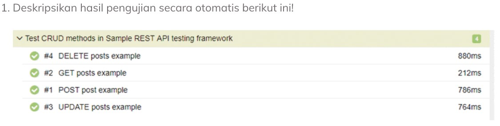
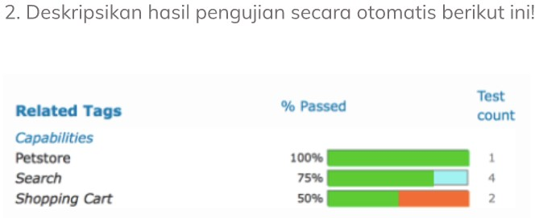

# Task **From Manual to Automation Testing**

## Task 1

Jawaban:
 Pada data diatas dapat diketahui bahwa:
    - ini sedang dilakukan test dengan metode CRUD(*Create, Read, Update and Delete*)dalam REST API testing framework. 
    - #1 hingga #4 menggambarkan urutan pada CRUD method.
    - Pada #1, jika kita ingin membuat/memasukkan sebuah data dapat dilakukan dengan method **POST**.
    - Pada #2, jika kita ingin membaca nilai sebuah data dapat dilakukan dengan method **GET**.
    - Pada #3, jika kita ingin memperbaharui nilai sebuah data dapat dilakukan dengan method **PUT**.
    - Pada #4, jika kita ingin menghapus nilai sebuah data dapat dilakukan dengan method **DELETE**
    - Nilai 880 ms, 212 ms, 786 ms dan 764 ms, merupakan gambaran waktu suatu node sistem untuk menanggapi permintaan (*reponse*) dari sebuah metode, biasa disebut *Response time testing*.
    - Pada #2 GET memiliki nilai response paling **cepat** yaitu 212ms yang menandakan proses ini berjalan tanpa/minim hambatan.
    - Pada #4 DELETE memiliki nilai response paling **lambat** yaitu 880ms yang menandakan proses ini memerlukan waktu lebih dikarenakan adanya hambatan dalam prosesnya. 

## Task 2

Jawaban :
 Pada data diatas dapat diketahui bahwa:
    - Terdapat 3 jenis yang diuji, yaitu Petstore, Search, dan Shopping Cart.
    - Pada **Petstore** dilakukan uji berjumlah sekali dan didapatkan hasil 100% berhasil dalam pengujiannya (berwarna hijau).
    - Pada **Search** dilakukan uji berjumlah empat kali dan didapatkan hasil 75% berhasil dalam pengujiannya (berwarna hijau) dan 25% belum teruji (berwarna biru keputihan).
    - Pada **Shopping Cart** dilakukan uji berjumlah dua kali dan didapatkan hasil 50% berhasil dan 50% gagal dalam pengujiannya.
