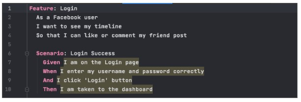
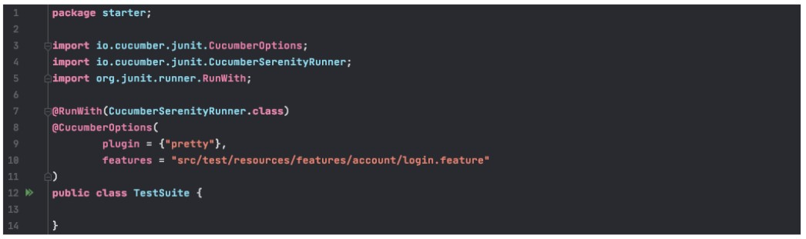
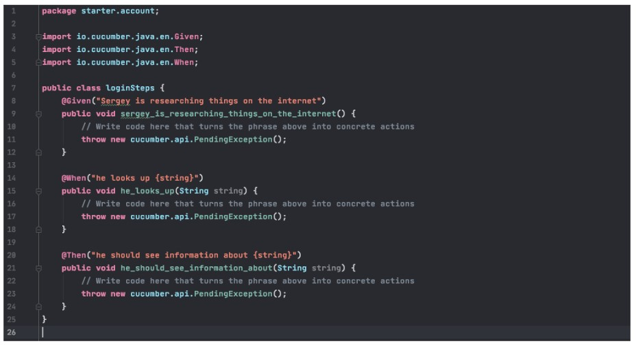

# (18)_Behaviour_Driven_Development

## *What is BDD?*

 BDD (Behaviour Driven Development) merupakan sebuah pola/cycle dalam kegiatan develop sebuah program. BDD ini bukan hanya membantu dalam mendevelop sebuah software, tapi itu memastikan kamu membuat software yang benar.
## *what is Cucumber?*

 BDD with Cucumber:
  - Write story (Given, When, Than)
  - Map Step to Java (buat script)
  - Configure Stories (Combine stories and steps)
  - Run Stories (Intellij IDEA)
  - View Reports

## *Demo BDD with Cucumber*

 1. Write Story (good story)
 

 2. Prepared tools (Java 1.8, Maven, Intelij IDEA)

 3. Open Intelij IDEA dan Cucumber Runner
  

 4. Create LoginStep
 
