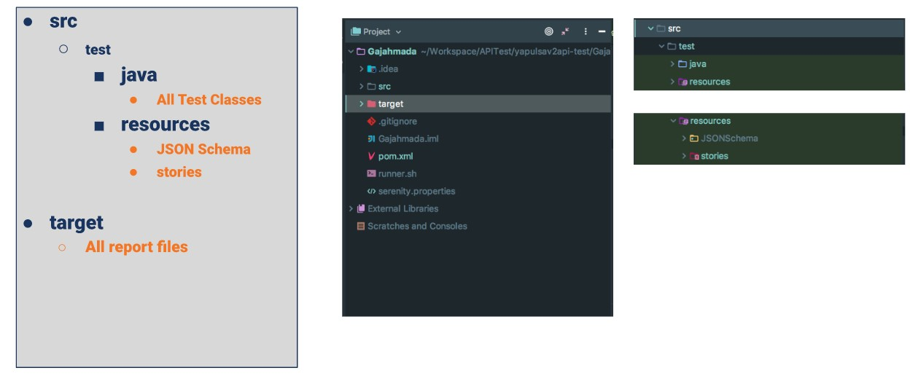
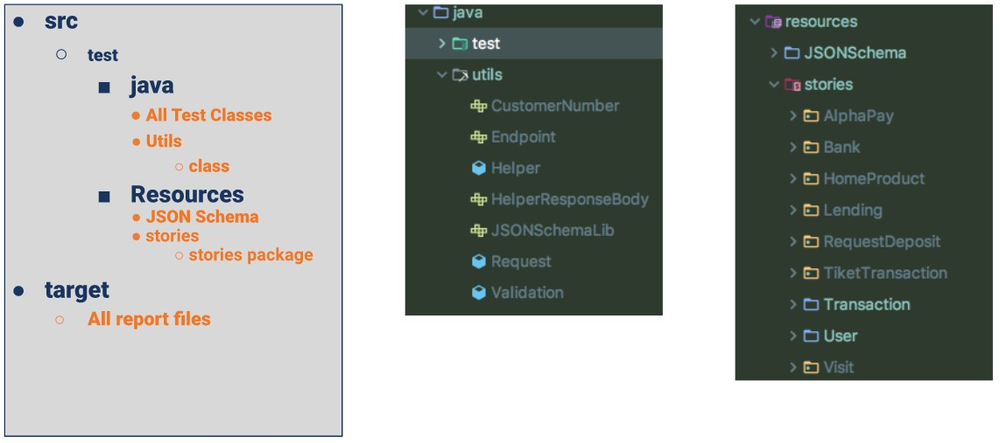
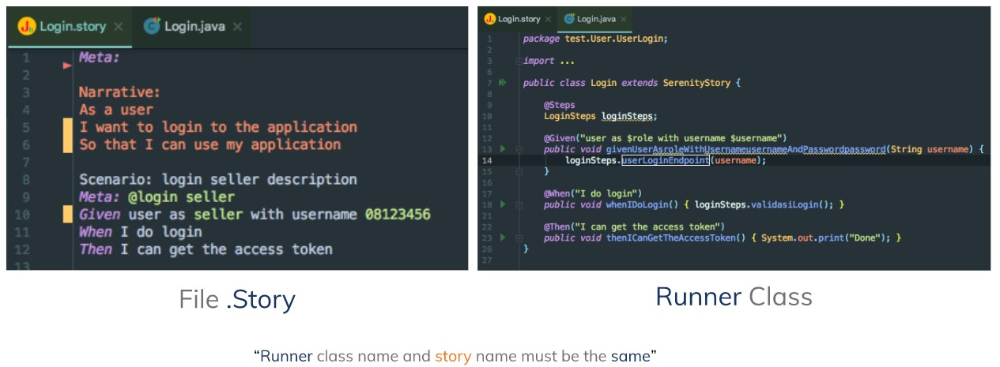
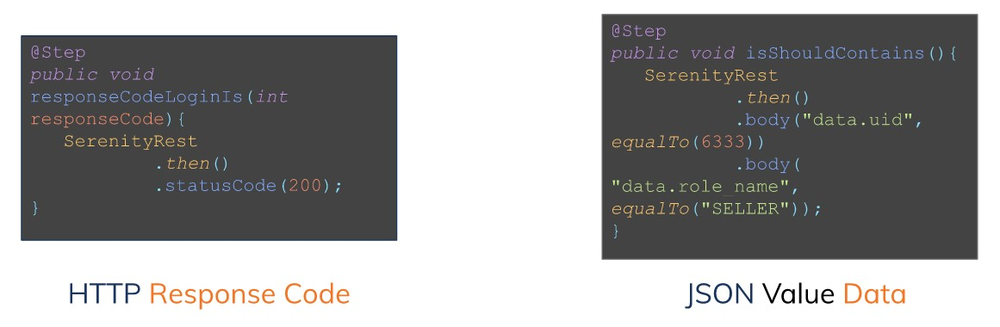
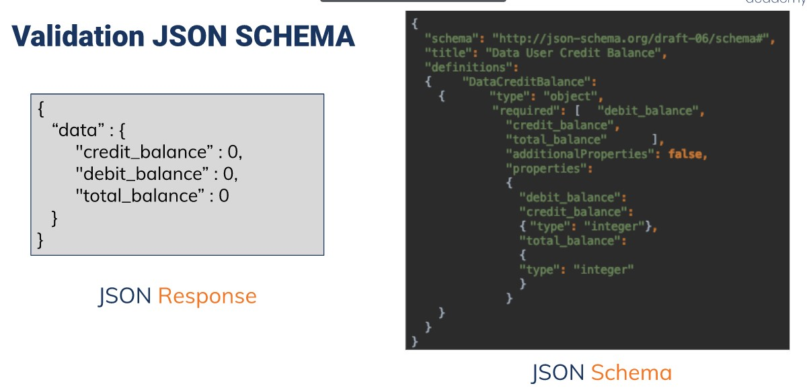
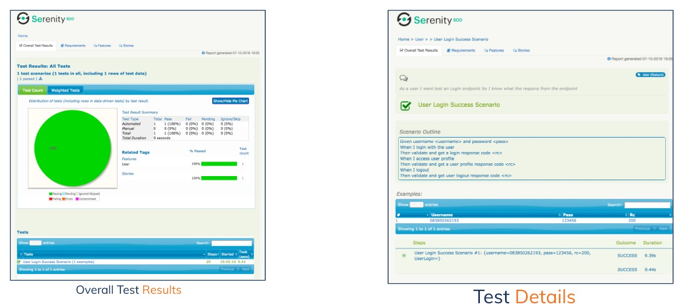

# (19)_RESTful_API_Testing_with_Rest_Assured

## REST API (API COncept and Fundamental)

 A. API Concept
  - User (mobile App) **request** ke Waiter (API), kemudian waiter (API) **request** ke kitchen (Applicator) 
  - Kitchen (Applicator) **response** ke Waiter (API), kemudian waiter (API)**response** ke User (mobile App).

 B. Fundamental API Integration
  - Mobile App
  - API Server
  - Ext Process
  - API Testing

 C. Fundamental API (Test Process)
  - Record, Define API Information
  - Parsing, Filter or recording API Data and then extract
  - Reconstruksi API calls, and sent them from a simulate client
  - Test Validation

 D. The Practical test Pyramid
  - UI (paling atas) -> (End to End dengan user Interface)
  - Integration (bawahnya UI) -> (Test interasksi antara dua modul atau subsistem dari API kontrak)
  - Component (Bawahnya integration) -> (Test spesifik modul atau subsistem dari API)
  - UNIT (Paling bawah) -> (Test part terkecil dari sebuah aplikasi dengan menggunakan metode)

## Rest Assured Features and Writing Test

 A. REST Assured and The Features
  - Support for HTTP Method
  - Support for BDD / Gherkin (GIven, When, Then)
  - Use of Homecrest matches for checks (equalTo)
  - User of Gpath for selecting element from JSON response

 B. Preparation
  - Java Development Kit (jdk)
  - Maven
  - Intellij IDEA

 C. Project Structure 
  - Standart

  

  - Advance

  

 D. Create a Story ad Runner Class

  

 E. Writing The Test
  - Test Setup
   a) .contentType()
   b) .header()

  - Test Action 
   a) .get(url), .post(), .delete(), etc.
   b) .log().all()
  
  - Test Verification
  a) .statusCode()
  b) .body("data.nama".equalTo("Kentir"))

 F. Validation Crucial Response

 

 G. Validation JSON SCHEMA

 

## SERENITY BDD

 
