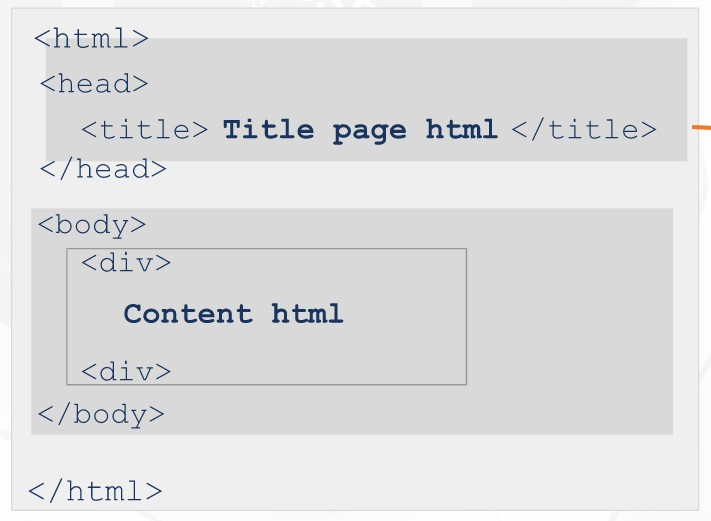
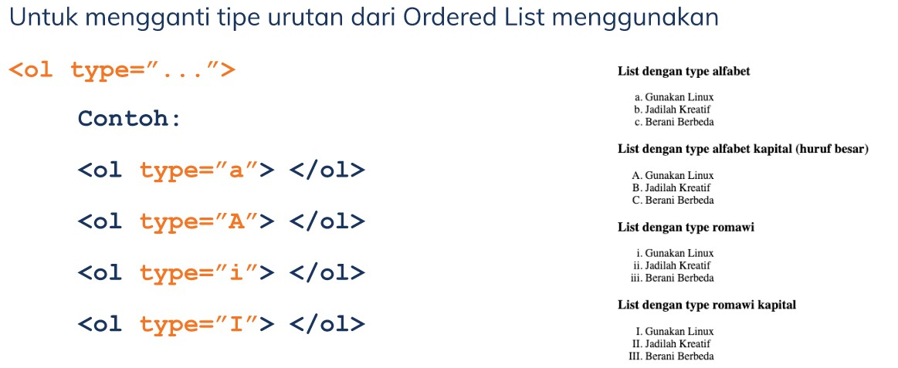
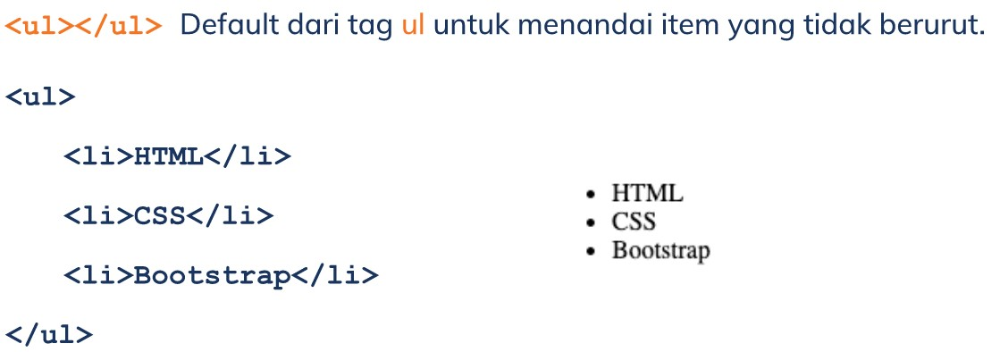
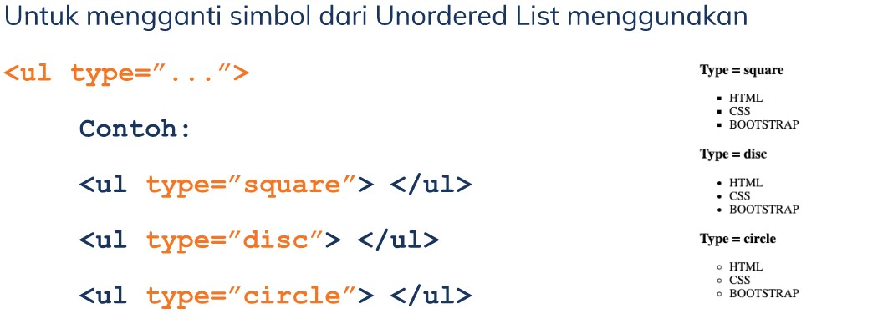
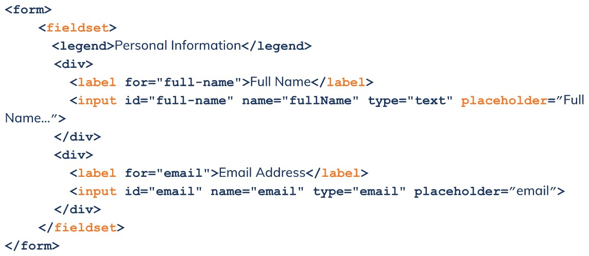
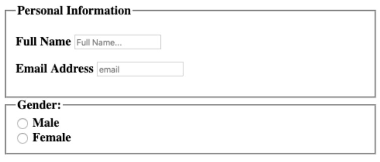
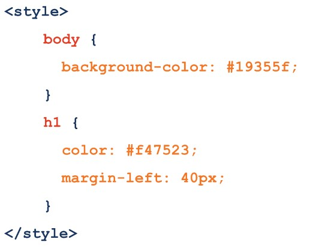
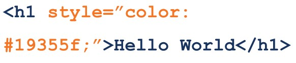
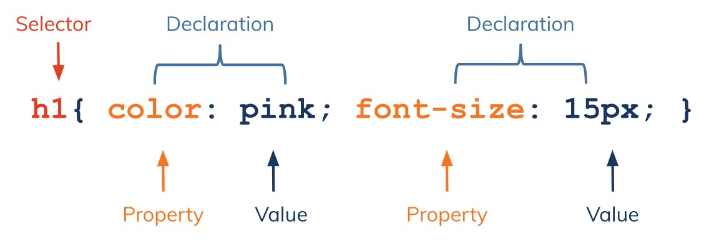

# (20)_Web_Programming

## HTML (Hypertext Markup Language)

 A. Pengertian HTML
  Merupakan sebuah standar yang digunakan secara luas untuk menampilkan halaman web.

 B. Dokumentasi HTML
  - <!DOCTYPE html> => mendefinisikan dokumen ini sebagai HTML5
  - <html> => elemen root dari halaman HTML
  - <head> => berisi info meta tentang dokumen
  - <title> => menentukan judul untuk dokumen 
  - <body> => berisi konten halaman yang terlihat

 C. Struktur HTML

  

 D. Contoh Tag HTML
  menggunakan tag div, contoh: 
content HTML 

 E. Tag Heading& Paragraph HTML
  heading dibagi dari heading 1 sampai 6, contoh:
  <h1> Heading satu</h1>
  <h2> Heading dua</h2>
  
 Paragraph

 F. Styling pada Paragraph HTML
  - <strong> membuat text lebih tebal </strong>
  - <em> penekanan pada text menjadi italic</em>
  - <s> membuat text dengan garis tercoret</s>
  -   (line break untuk membuat garis baru)

 G. Tag Link HTML
  - Langsung
  <a href="https://www.google.com"> web google </a>
  
  - Membuka tab baru
  <a href="https://www.google.com" target="_blank"> web google </a>

 H. Tag Image HTML
  

 I. List HTML
  Ada dua jenis List dalam HTML:
   1. Ordered List adalah list yang berurut. (<ol>)
   2. Unordered List adalah list yang tak terurut. (<ul>)
  
  Setiap ol dan ul di deklarasikan menggunakan tag <li>

  Cara order List HTML
  <ol></ol> Default dari tag ol untuk menandai item yang terurut.
  <ol>
    <li>HTML</li>
    <li>CSS</li>
    <li>Bootstrap</li>
  </ol>
  outputnya : 
   1. HTML
   2. CSS
   3. Botstrap
  
  Contoh Ordered List HTML

  

  Contoh Unordered List HTML

  
  
 
 J. Tag Table HTML
  - Membuat table pada HTML menggunakan tag <table></table>
  - Setiap **baris** table di deklarasikan menggunakan <tr></tr>
  - Setiap **kolom** table di deklarasikan menggunakan <td></td>
  - Untuk kolom pada table header menggunakan <th></th>

  Contoh Tag Form HTML
   
   

## CSS (Cascading Style Sheets)
 A. Pengertian
  - Dapat menghias halaman web (color, size, font, backgound, width, height, dll). 
  - Dapat mengatur posisi pada halaman web (float, align, display, position, dll).

 B. Menambahkan file CSS
  3 cara menambahkan file CSS ke dalam HTML:
   1. External CSS
    <link rel="stylesheet" href="main.css">
    syntax ini disisipkan ke dalam tag <head> pada HTML. Ekstensi file CSS adalah .css

   2. Internal CSS
    Sytax ini dapat digunakan di dalam satu file HTML. Didefinisikan di dalam elemen <style>, di dalam bagian <head> atau di dalam bagian <body>

    

   3. Inline CSS
    Sytax ini dapat digunakan untuk elemen tunggal pada HTML. Diprioritaskan untuk menerapkan style yang unik.

    

 C. Syntax CSS

 

## BootStrap
  
