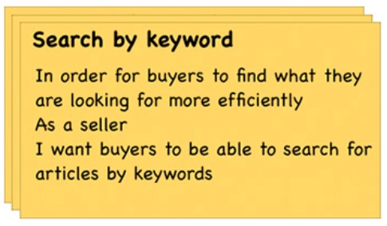
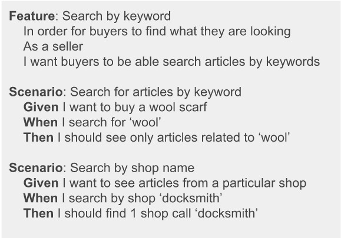
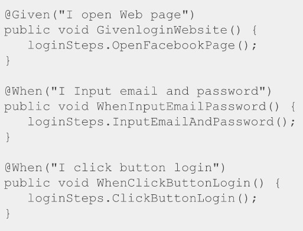
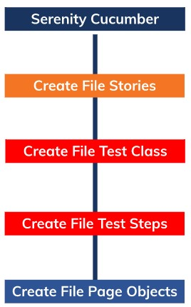
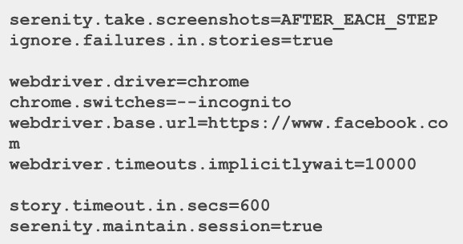
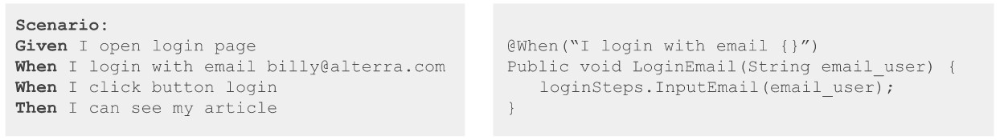
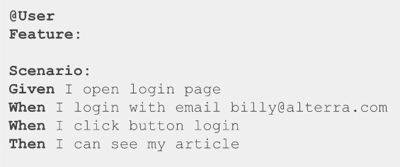
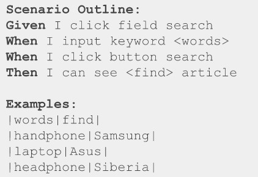

# (21)_Review_Web_UI_Testing_with_Serenity

## Introduction Serenity BDD

 A. Architecture Serenity BDD
  Serenity adalah sumber terbuka Framework BDD yang menolong dalam membuat struktur penulisan, pemeliharaan otomasi, dan acceptance test yang baik. Struktur serenity termasuk dari **Requirements, Test, Steps, Pages, and Reports**.

 B. Requirements
  - Ketika menggunakan serenity, kamu memulai dengan kriteria/requirements yang kamu butuhkan dalam implement.
  - kriteria sering di ekspresikan sebagai **user story** dengan acceptance criteria yang menolong dalam klarifikasi dari kriteria.
  - contoh user story

  

 C. Acceptance Criteria
  - setelah membuat user story, selanjutnya mendeskripsikan kriteria yang dapat diterima (acceptance criteria) dalam high-level bussiness terms.
  - Record acceptance criteria menggunakan BDD tools, yiatu Cucumber dengan format "**feature**", sehingga Serenity dapat menjalankan itu. contoh acceptance criteria:

  

  - Implementasi dari acceptance criteria kedalam code, jadi mereka dapat mengaplikasikan secara aktual. contohnya:

  

 D. Reporting
  dalam hal ini serenity menyediakan detail report dalam test results dan eksekusinya, meliputi:
   - naratif dari tiap testnya
   - Screenshoot untuk step di dalam testnya
   - Hasil test meliputi waktu eksekusi dan error message jika ada test yang gagal.

## BDD Framework with Cucumber
 A. Writing The Test (Using Serenity Cucumber)
  Susunan dalam menulis test yaitu sebagi berikut:
   - Define Test Scenario
   - Automate Stories
   - Define Scenario Steps
   - Interact With Browser
  jika dapat digambarkan sebagai berikut:

  

## Digging Deeper
 A. Serenity Properties
  - Serenity support banyak properties untuk customize the way test is run
  - Webdriver.driver define which browser will be used to test
  - Ignore.failures.in.stories set the serenity to continue testing the next scenario even current scenario is failed.

  

 B. Parameter Injection
  - Text dalam story dapat digunakan sebagai variable, menggunakan bracket{} dalam anotasi string di dalam test class.
  - Contoh:
  
  

  "billy@alterra.com" is used as variable named email_user

 C. Meta Filtering
  - dalam penggunaannya untuk membantu memanage story scenario, kita dapat menggunakan "**tag**" untuk corresponding feature or secnario
  - Untuk menjalankan test dengan spesifik tag, gunakan command **Mwn verify -Dtags="@User"

  

 D. Parameterised Scenario
  - dalam story, scenario dapat berupa parameterised with configured value
  - Parameterised scenario sama dengan multiple scenario tetapi berbeda value. contoh:

  
