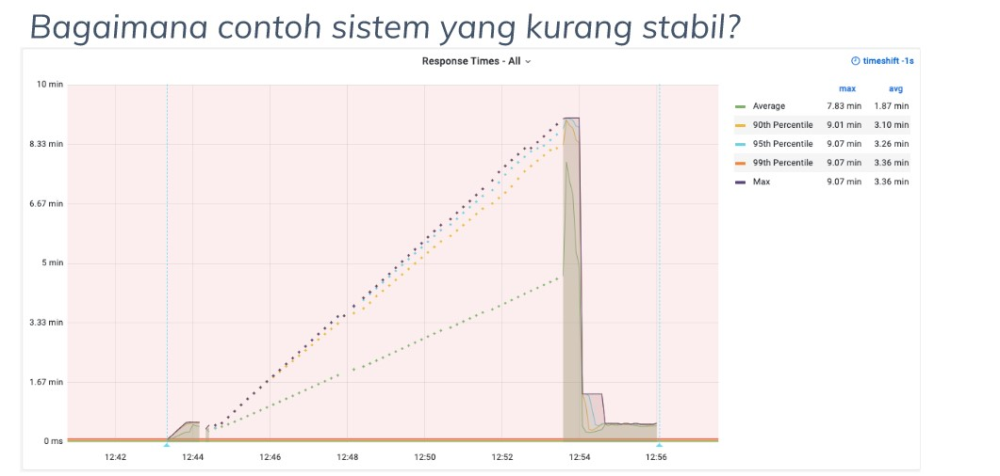

## Part 1

1. Apa itu volume test? Apakah sama dengan load test?
 Jawaban:
 Volume test merupakan salah satu non-fungsional test yang menguji ketahanan suatu sistem ketika diberikan database yang banyak, atau dikenal juga dengan istilah flood test. Volume test ini berbeda dengan load test. Load test hanya menguji ketahanan secara umum sedangkan volume test berfokus pada sistem databasenya.

2. Bagaimana contoh sistem yang kurang stabil?
 
 Jawaban:
 Sistem yang stabil merupakan sistem yang ada pada rata-rata atau lebih rendah dari uji kinerja, sedangkan sistem yang tidak stabil merupakan sistem yang ada diatas dari rata-rata kerja.
 
