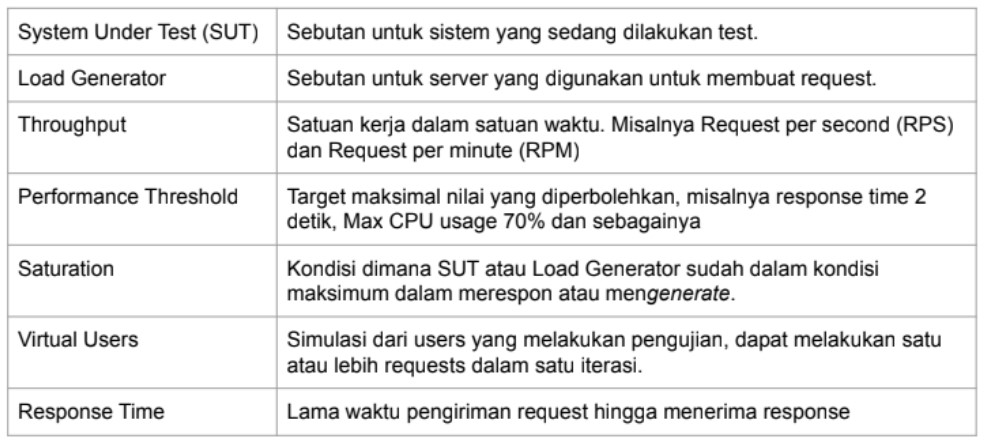

# (22)_Fundamental_Performance_Test

## Performance Test
 A. Pengertian *performance test*
  - Merupakan teknik **non fungsional testing** untuk menentukan parameter sistem dalam hal responsif dan stabilitas dibawah berbagai beban (*load*) kerja.
  - Performance testing mengukur kualitas atribut dari sistem seperti **stabilitas, ketahanan (reliability), dan penggunaan sumber daya**.
 B. Hal yang diukur dalam *performance test*
  - Performa suatu aplikasi **sampai suatu batas tertentu**.
  - Bukan merupakan fungsional-test
  - Bisa dalam **berbagai macam bentuk** untuk memahami *reliability, stability, dan availability* pada *environment*-nya. contoh:
   - mengamati *response time* ketika menjalankan request dalam jumlah yang sangat banyak.
   - Melihat suatu sistem berinteraksi dengan jumlah data yang cukup besar.
 C. Mengapa *performance test* jarang dilakukan?
  *performance test* cukup mahal untuk dijalankan. namun dapat diadikan tolak ukur apakah sistem tersebut dapat mengakomodasi traffic yang ada. 
  Faktor mahal karena pengetesan memerlukan persiapan, seperti *environment* terpisah dari *production* agar tidak tercampur data test dengan data production.
  *environment* ini ada juga yang membuatnya di server cloud yang biayanya bisa lebih mahal dari *environment production*
 D. Hal yang diperhatikan dari *performance test*
  - *throughtput*
  - *response data*

## Contoh kasus *performance test*
 Sebuah sistem baru akan di launch ke *production*, namun sebelum masuk ke *production* perlu dilakukan *performance test* untuk mengetahui *throughtput* dan *response data* dari sistem tersebut. Untuk informasi *endpoint* yang akan di test adalah:
  - /login
  - /beli-pulsa
  - /cek-out

 Langkah yang harus dilakukan:
  1. Membuat test plan
  2. Membuat script test
  3. Melakukan *performance test*
  4. Menganalisa hasil *performance test*

## Metode *performance test*
 1. Membuat Test Plan
 2. Menentukan metode test
    - Smoke testing
    - Load testing
    - Tabel Tier
    - Stress Testing
    - Spike Testing
    - Soak Testing

## Istilah dalam *performance test*

 

