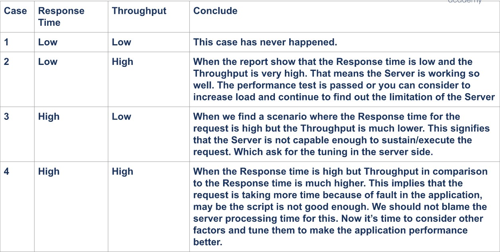

# (25)_Understanding_Jmeter_Results

## How to run JMeter

 1. Open JMeter
  a. Open Terminal
  b. Navigate to the bin folder
  c. Run JMeter

 2. Create your Test plan

 3. Report of JMeter
  a. Summary Report
  b. Aggregate Report
  c. Throughput
   Throughput = (number of request)/(total time)*conversion
   where:
   - Number of request => number of executed request
   - total time = (lastSampleStartTime + lastSampleLoadTime - firstSampleStartTime)
   - conversion => unit of conversion value

 4. Quick Analyze

    

## Overview of a Performance Test Report

 1. Pembahasan Data yang sudah dimiliki
  a. Summary tentang sistem
  b. kondisi awal sistem
  c. Target yang ingin dicapai

 2. Data Performance test yang didapatkan
  Masukkan data dari metrics yang didapatkan 

 3. Interpretasi Data Performance Test
  Interpretasi hasil dari metricsnya

 4. Saran
  Berikan saran agar sistem lebih baik lagi setelah dites

## Case Studies of Performance Testing

 1. Usage in e-commerce
  a. Know current normal load/capacity
   - New feature added
   - it just checking
  b. Know the capacity on a special event
   - Usual special event (Lebaran) 
   - Quick special event
  c. The Question
   - Apa endpoint yang biasanya akan ditest?
   - Apa alur transaksinya?
   - Apa kendala yang sering muncul saat performance test?

 2. Usage in payment gateway
  a. Know current normal load/capacity
   - New feature added
   - it just checking
  b. Know the capacity on a special event
   - Usual special event (Lebaran) 
   - Quick special event 
  c. The Question
   - Apa endpoint yang biasanya akan ditest?
   - Apa alur transaksinya?
   - Apa kendala yang sering muncul saat performance test?