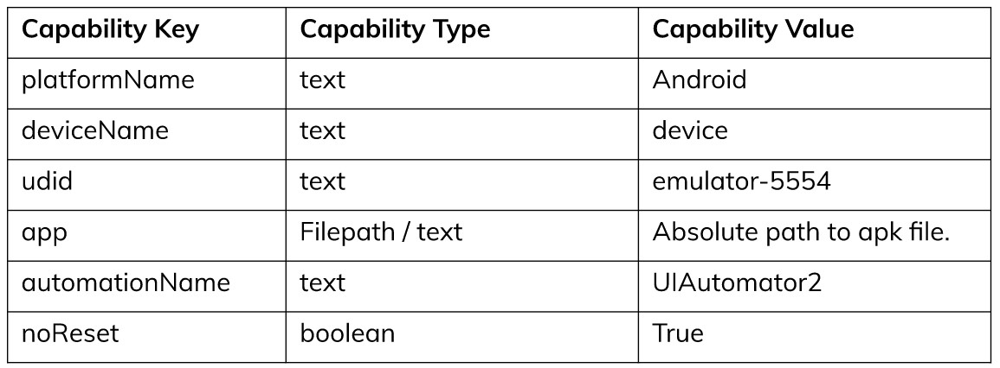
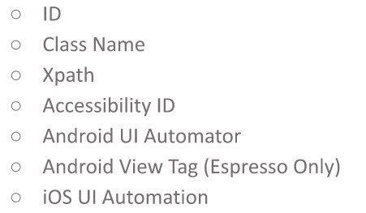

# (26)_Mobile_Testing

## Appium Intro 

 A. Intro
  - Appium adalah mobile automation frameworks to run mobile automation test.
  - Appium didukung banyak bahasa pemrograman seperti java, python, javascript, rubt, dll
  - Appium library di buat in top of selenium library
  - Penggunaan ini didukung oleh android, iOS, dan Windows apps
 B. Appium Components
  - Appium Server digunakan sebagai jembatan untuk mengontrol the testing devices. Ada dua versi yaitu *appium desktop* dan *install appium command using npm*
  - Appium Client merupakan library written in several language to create test script so we can send the command to the appium server.

## Installing Appium

 Harus disiapkan beberapa tools
  - Java JDK 8/11
  - Install Android SDK
  - Install Appium Desktop
  - Install Node JS
  - Config with appium-doctor (untuk checking dari semua file diatas)

## Running Appium Desktop & Inspector

 A. Connecting the Devices
  - Sebelum memulai, real device harus terhubung dengan local komputer
  - Untuk real device harus install the device drivers dan aktifkan usb debugging (harus developer mode)
  - Untuk emulator, dapat menggunakan android studio dan create a new one.

 B. Checking the Connected Devices
  - cara check apakah device sudah terhubung dengan memasukkan command **adb devices** pada command prompt

 C. Running Appium Desktop (just click **start server** button)

 D. Using Appium Inspector 
  Untuk melihat inspect dari mobile, caranya hanya click tombol **kaca pembesar**.

 E. Desired Capabilities 
  Ini digunakan untuk menjelaskan ke appium seperti apa kapabilitas yang akan digunakan untuk running android, iOS, atau Windows app. contoh:

  

 F. Filling the capabilities
 G. Appium Inspector
  ini digunakan untuk menemukan elemen dari sebuah lokasi (buttom, input, etc)
 H. Appium Locator
  Merupakan lokasi dari elemen (button, input, etc) dan lokasi yang bisa digunakan yaitu **ID, Accessibility ID, and Xpath**. Full info: (https://www.browserstack.com/guide/locators-in-appium)

  
