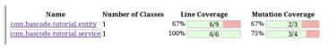

# ANALISIS SOAL PENUGASAN 

## 1. Tuliskan secara lengkap, simpulan dari gambar dibawah!

**jawaban :**

Berdasarkan gambar dapat diketahui ada beberapa masalah dari *line converage* dan *mutation coverage*. 
Pada *line converage* ditemukan beberapa hal, yaitu:
    1. Pada (com.hascode.tutorial.entity) sudah dilakukan pengecekan dan ditemukan 3/9 atau 33% bermasalah (berwarna merah) dan 6/9 atau 67% tidak ada masalah (berwarna hijau).
    2. Pada (com.hascode.tutorial.service) sudah dilakukan pegecekan dan tidak ditemukan permasalahan (6/6 atau 100% berhasil).
Pada *mutation coverage* ditemukan beberapa hal, yaitu:
    1. Pada (com.hascode.tutorial.entity) sudah dilakukan pengecekan dan ditemukan 1/3 atau 33% bermasalah (berwarna merah) dan 2/3 atau 67% aman (berwarna hijau).
    2. Pada (com.hascode.tutorial.service) sudah dilakukan pegecekan dan ditemukan 1/4 atau 25% bermasalah (berwarna merah) dan 3/4 atau 75% aman (berwarna hijau).