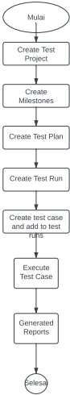

# (7)_Test_Case_Management_Tools

### A. Test Case Management Tools 
    Test Case Management Tools adalah situs atau software yang digunakan software tester untuk menyimpan informasi terkait bagaimana pengujian produk harus dilakukan, perancanaan kegiatan pengujian, serta dokumen terkait pelaporan status kegiatan penjaminan suatu kualitas produk.
    Atau gampangnya, Test Case Management Tools adalah alat yang digunakan untuk melakukan eksekusi dari satu atau banyak test case dokumen.

### B. Mengapa kita butuh Test Case Management Tools???
    1. Plan and Estimate 
        Plan : Deskripsi fitur yang akan di test, yang tidak akan di test, resouce, dan jadwal dari pelaksanaan test
        Estimate : memperkirakan seberapa lama ini akan berlangsung

    2. Monitoring dan controlling 
        Monitoring : proses menerima, merekam, dan melaporkan informasi mengenai aktivitas sebuah projek kepada pihak yang berkepentingan.
        Controlling : Proses menggunakan data dari tahap mentoring untuk memberikan performa aktual menuju performa target (mengejar target/dl)

    3. Reporting and Integrate with another tools 
        Test Case Management Tools juga dapat membuat laporan dari hasil analisisnya, dan beberapa dapat berintegrasi dengan tools lain seperti JIRA, Pivotal, Redmine, Jenkis, Travis.

    Macam-macam Test Case Management Tools
        1. TestRail	    2. Testlink
        3. Zephyr	    4. Qtest
        5. PractiTest	6. TcLab

### C. How To Use TestRail
    1. Open TestRail di browser dan sign in dengan authentication
    2. Membuat a Test Project Management
    3. Wajib isi semua kolom atau dapat di kustom
    4. Buat Milestones (kaya semacam timeline)
    5. Creat Test Run
    6. Creat Test Plan
    7. Create Test Cases
    8. Test Report

    Alur kerja TestRail : 

