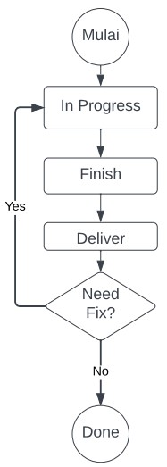

# (8)_Tracking_Management_Tools

## A. Tracking Management Tools (JIRA)
    Jira adalah alat bantu yang bertujuan untuk pelacakan bugs, pelacakan issue, dan management proyek.
    Kelebihan jira :
        1. Test Assigment = dilengkapi antar muka mengenai work flow yang dijalankan. Hal ini membuat anggota tim bahkan tim lain dapat mengetahui sejauh mana progress suatu projek tersebut
        2. Scrum and Kanban board = metode -> fitur ini digunakan untuk brainstroming dan dapat digunakan untuk berkolaborasi dalam menentukan skala prioritas kerjanya, dapat mengetahui masalah dari rekan kerjanya
        3. Roadmaps = Gambaran projek kedepannya
        4. Konektivitas dengan apk lain
        5. Reporting

## B. Creating Project and New Issues
    Creating Project dengan Metode scram
        1. Klik menu projek, maka akan ada sub menu, pilih create projek
        2. Akan ada pilihan metode (Scrum, kanban, dan bug tracking), pilih scrum
        3. Konfirmasi kalo kita pake scrum
        4. Setelah itu pilih tipe project, pilih team managed (satu projek dan tidak terikan dengan projek lain)
        5. Buat nama projek, dan create projek
        6. Setelah sukses bikin projek akan ada 3 panel, to do, inprogress, done.
        7. Kalo buat panel klik tambah

    Panel
        1. To Do = Berisi hal yang akan dikerjakan dan sudah diprioritaskan saat planing. Urutan story menandakan prioritas
        2. In Progress = Berisi hal yang sedang dikerjakan oleh Software Engineer.
        3. Finish = Berisi hal yang telah selesai dikerjakan oleh para Software Engineer, namun belum siap untuk tahap testing.
        4. Deliver = Berisi story yang siap memasuki tahap testing oleh para QE
        5. Need Fix = Berisi hasil proses testing yang tidak lolos kriteria oleh team development
        6. Done = Panel yang berisi fitur-fitur yang sudah lolos dari kriteria testing oleh development team

    Issues pada JIRA akan melacak masalah yang mendasari proyek ataupun bug.
    Cara membuat Issues :
        1. Click create
        2. Pilih projek yang sesuai dengan isu yangakan dibuat dan ditempatkan di projek tersebut.
        3. Issue Type : Story (untuk isu baru), Task (hal yg akan dikerjakan), bug (jika bertemu bug), epic (pengelompokan task) 
        4. Summary : diisi dengan judul dari isu yang akan kita buat.
        5. Description : harus dituliskan dengan jelas menggunakan format yang sama dengan dituliskan pada pivotal tracker.
	        Kondisi desc : 	
                a. Acceptance Criteria, jika fitur yang dibuat sudah sesuai dengan acceptance criteria yang ditentukan development team
			    b. Test Implementation, membuat dokumentasi setelah melakukan proses testing (Test Scenario)
        6. Assignee : menunjuk orang yang bertanggung jawab atas tugas yang diberikan
        7. Sprint : ditentukan berdasarkan dari ruang waktu pengerjaan sebuah task atau issue (1/2 minggu).
        8. Priority : ditentukan berdasarkan tingkat kesulitan sebuah task atau issue.
        9. Reporter : ditentukan berdasarkan yang membuat tugas tersebut

## C. Info Tambahan
    Hal yang harus diperhatikan oleh QE pada JIRA
        1. Membuat issue bertipe bug saat ditemukan ada yang tidaksesuai dengan kriteria testing
        2. Memindahkan fitur yang berkaitan dengan bugs ke kolom "in progress"
    
    Fase pada JIRA
