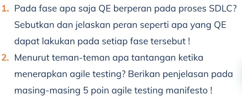

# SOAL

Jawaban:

 1. SDLC (*software development life cycle*) memiliki beberapa step, yaitu *Requirement*, *Design*, *Development*, *Testing*, *Deployment*, dan *Maintenance*. QE berperan penting pada salah satu tahap SDLC, yaitu pada fase *testing*. Pada fase ini QE diwajibkan melakukan *testing* dengan membuat test scenario dan test case dari setiap kemungkinan yang ada pada semua fitur yang telah di develop. Jika diartikan dengan bahasa yang lebih sederhana, tugas QE adalah membuat dan melakukan *Test Scenario and Test Case* pada tiap tahapan, mulai dari *fase design* sampai *fase maintenance*

 2. Menurut saya, tantangan yang dihadapi QE dalam menerapkan agile testing adalah menghadapi poin b dan c, serta menerapkan poin a. Karena pada dasarnya tugas QE adalah mencegah bug dari sebuah sistem dan diperlukan pengujian yang detail dan teliti. Namun dalam penerapannya pasti ditemukan conflict dengan bagian yang lain terkait bug yang ditemukan dan seolah-olah dianggap mencoba merusak sistem, namun pada dasarnya QE juga ingin menciptakan *high quality* dari sebuah software. Jadi diperlukan kerjasama tim yang baik serta rasa saling memahami terkait tujuan awal dalam mendevelop suatu software. 
 Berikut poin yg saya maksud      
    a. Testing adalah kegiatan bukan fase
    b. Mencegah bug daripada menemukan bug
    c. Jangan jadi pemeriksa, jadilah penguji (user prespektif)
    d. Jangan coba-coba merusak sistem, bantulah membangun sistem sebaik mungkin
    e. Seluruh tim bertanggung jawab atas kualitas, bukan hanya penguji